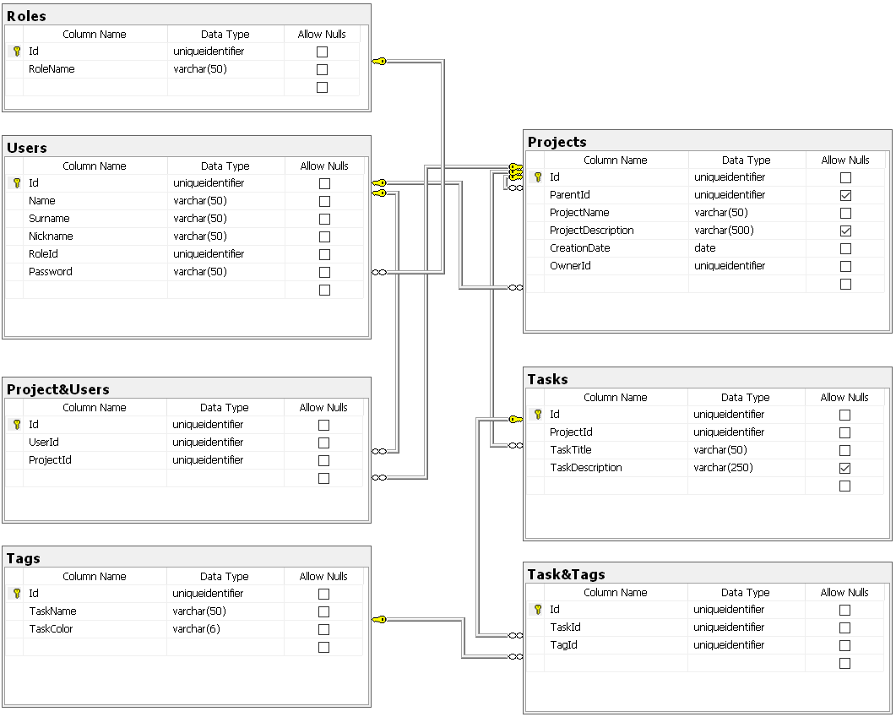

# graduationWork
## TODO
Полезные (для меня) ссылки с используемыми модулями, полезными сайтами или статьями

### [General]
[MakeFile](https://habr.com/ru/post/461467/) [(Download)](http://gnuwin32.sourceforge.net/packages/make.htm) \
[Project structure](https://medium.com/nuances-of-programming/идеальная-настройка-вашего-следующего-golang-проекта-1b2108c365e) 
[(Git)](https://github.com/MartinHeinz/go-project-blueprint)

### [Config]
[Конфиг](./config/config.yaml) `./config/config.yaml` 
* [YAML v2](https://github.com/go-yaml/yaml/) 
  * [Англ. гайд по yaml](https://www.cloudbees.com/blog/yaml-tutorial-everything-you-need-get-started) 
  * [JSON to YAML](https://www.json2yaml.com) чтобы посмотеть как выглядит/проверить ошибки

### [Tags]
- цвет текста тега зависит от цвета фона(hex) 
  
  
### [Database]
 \
**Идеи**  
- селектор бд по конфигу, что заполнено то и использовать, если несколько то выбор режима
    - дублирование
    - резервная копия
    - резервный сервер
    - использовать что-то одно)
  
### [endpoints]
- [ORM](https://github.com/go-reform/reform)  
- [Router](https://github.com/gin-gonic/gin)
- [Middleware](https://github.com/gin-gonic/contrib)
  * [Auth(OAuth2)]()
  
 
    
JWT,OAuth,OAuth2

    Firstly, we have to differentiate JWT and OAuth. Basically, JWT is a token format. OAuth is an authorization protocol that can use JWT as a token. OAuth uses server-side and client-side storage. If you want to do real logout you must go with OAuth2. Authentication with JWT token can not logout actually. Because you don't have an Authentication Server that keeps track of tokens. If you want to provide an API to 3rd party clients, you must use OAuth2 also. OAuth2 is very flexible. JWT implementation is very easy and does not take long to implement. If your application needs this sort of flexibility, you should go with OAuth2. But if you don't need this use-case scenario, implementing OAuth2 is a waste of time.
  

- [Swagger](https://github.com/swaggo/gin-swagger)
   * [Example main](https://github.com/swaggo/swag/blob/master/example/celler/main.go)
   * [Example func](https://github.com/swaggo/swag/blob/master/example/celler/controller/examples.go)
  
**Base Path**  
> /api/v1  

**General**
> /health

**Users**
> /login \
> /register \
> /logout 

**Roles**
> /roles [Get] Get list of all roles \
> /role?name=&privileges= [Post] Create role \
> /role \
> /role?name= [Get] Get role with this id 

**Tags**
> /tags [Get] Get list of all tags \
> /tag?name=&ccode= [Post] (name,colorCode) Create tag

**Tasks**
>

**Projects**
>
