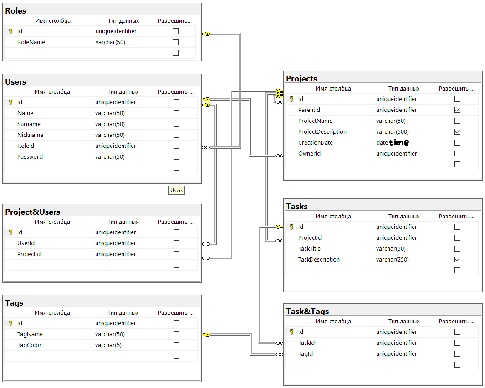

# graduationWork
## TODO
Полезные (для меня) ссылки с используемыми модулями, полезными сайтами или статьями

### [General]
[MakeFile](https://habr.com/ru/post/461467/) [(Download)](http://gnuwin32.sourceforge.net/packages/make.htm) \
[Project structure](https://medium.com/nuances-of-programming/идеальная-настройка-вашего-следующего-golang-проекта-1b2108c365e) 
[(Git)](https://github.com/MartinHeinz/go-project-blueprint)

### [Config]
[Конфиг](./config/config.yaml) `./config/config.yaml` 
* [YAML v2](https://github.com/go-yaml/yaml/) 
  * [Англ. гайд по yaml](https://www.cloudbees.com/blog/yaml-tutorial-everything-you-need-get-started) 
  * [JSON to YAML](https://www.json2yaml.com) чтобы посмотеть как выглядит/проверить ошибки

### [Tags]
- цвет текста тега зависит от цвета фона(hex) 
  
  
### [Database]
 \
**Идеи**  
- селектор бд по конфигу, что заполнено то и использовать, если несколько то выбор режима
    - дублирование
    - резервная копия
    - резервный сервер
    - использовать что-то одно)
  
### [endpoints]
- [Example](https://github.com/eddycjy/go-gin-example)
- [ORM](https://github.com/go-reform/reform)  
- [Router](https://github.com/gin-gonic/gin)
- [Middleware](https://github.com/gin-gonic/contrib)
- [Swagger](https://github.com/swaggo/gin-swagger)
   * [Example main](https://github.com/swaggo/swag/blob/master/example/celler/main.go)
   * [Example func](https://github.com/swaggo/swag/blob/master/example/celler/controller/examples.go)
